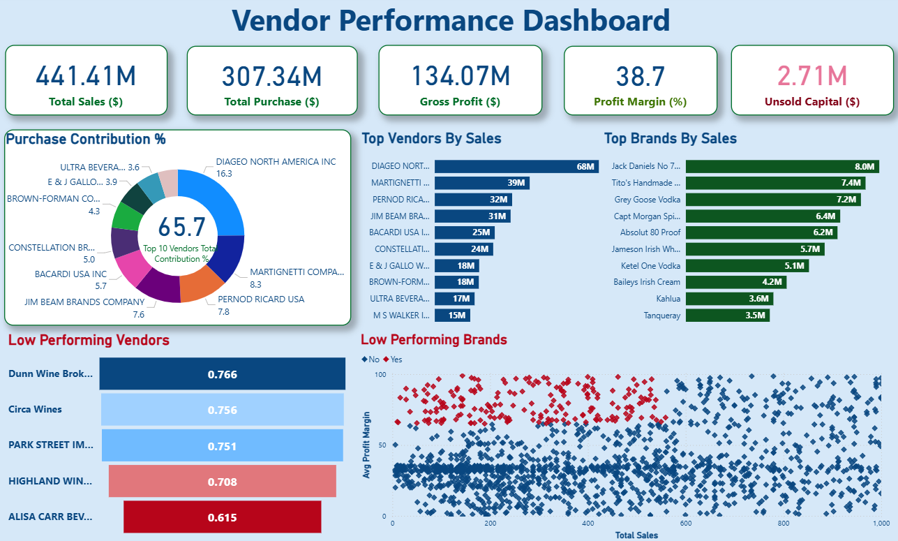

# 📊 Vendor Performance Report - Power BI Dashboard

This project is a Power BI dashboard designed to analyze and visualize vendor performance using dummy data. The dashboard helps stakeholders identify top-performing vendors, low performers, delivery timelines, and other KPIs essential for decision-making.

---

## 🛠 Tools & Technologies

- **Power BI Desktop (.pbix)**
- **SQL** 
- **Microsoft Excel** 
- **DAX (Data Analysis Expressions)** 
- **Power Query Editor** 

---

## 📂 Files Included

- `Vendor_Performance_Report.pbix` – The Power BI dashboard file
- `Vendor_Data.xlsx` – Dummy data used for the project
- `README.md` – This file

---

## 🖼️ Dashboard Screenshots

  

---

## 🔑 Key Insights

- Identified top 5 and bottom 5 vendors by performance score
- Analyzed delivery punctuality trends over time
- Vendor-wise total quantity delivered and defects count
- Monthly average performance ratings
- Interactive filters by region, category, and vendor

---

## 🔄 Data Flow

1. **Data Ingestion**: Source Excel file read using Power BI
2. **Data Transformation**: Cleaned & reshaped using SQL scripts and Power Query
3. **Modeling**: Relationships created among tables (fact and dimension)
4. **Calculations**: Measures defined using DAX
5. **Visualization**: Final report designed with slicers, bar charts, KPIs, etc.

---

## 🚀 Getting Started

1. Clone this repo
2. Open `Vendor_Performance_Report.pbix` in Power BI Desktop
3. Refresh the data using the Excel file provided
4. Explore insights interactively!

---

## 📎 Author

**Mridul Gupta**  
[LinkedIn](https://www.linkedin.com/in/mridulgupta18/) | [GitHub](https://github.com/gupta1811)

---

## 📝 License

This project is for educational/demo purposes only.
